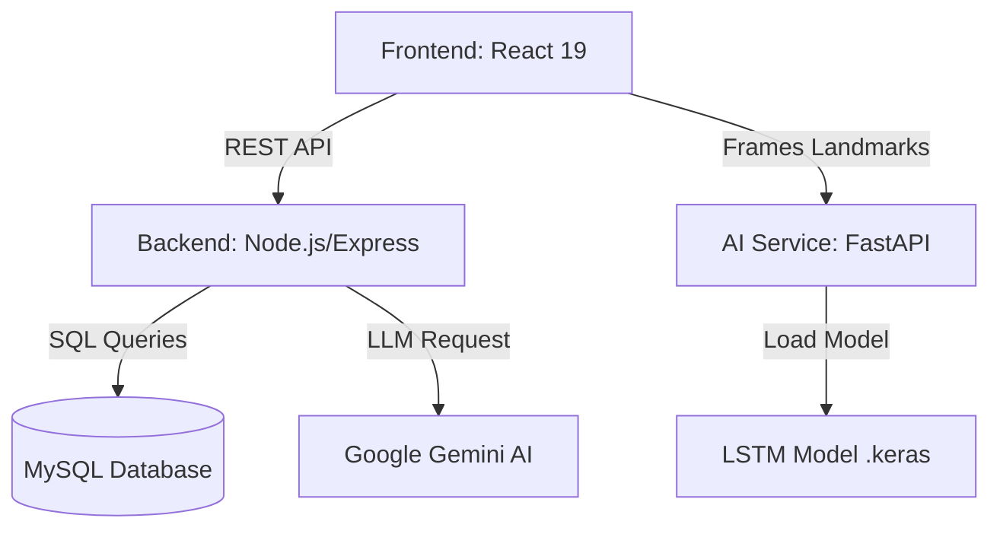

# BÁO CÁO CHI TIẾT ĐỒ ÁN: VSL - VIETNAMESE SIGN LANGUAGE PLATFORM

**Thành viên thực hiện:** Từ Hữu Minh Vũ, Phạm Thị Minh Ngọc
**Thời gian thực hiện:** 01/2026 - 02/2026
**Mức độ hoàn thiện:** 90% (Giai đoạn Beta)

---

## 1. GIỚI THIỆU TỔNG QUAN
Dự án VSL (Vietnamese Sign Language) là một hệ thống đa nền tảng (Web-based) ứng dụng Trí tuệ nhân tạo (AI) và Thị giác máy tính (Computer Vision) nhằm giải quyết rào cản giao tiếp cho người khiếm thính tại Việt Nam. Hệ thống cung cấp một quy trình học tập khép kín từ lý thuyết (Video), củng cố (Quiz) đến thực hành thực tế với phản hồi AI thời gian thực.

## 2. PHÂN TÍCH BÀI TOÁN & GIẢI PHÁP
### 2.1 Đặt vấn đề
- **Rào cản ngôn ngữ:** Sự khác biệt giữa ngôn ngữ nói và ngôn ngữ ký hiệu khiến người khiếm thính khó tiếp cận giáo dục và dịch vụ công.
- **Thiếu công cụ tự học:** Các ứng dụng hiện nay đa phần là từ điển tĩnh, thiếu công nghệ nhận diện để kiểm tra tính chính xác của hành động.

### 2.2 Giải pháp đề xuất
Xây dựng hệ thống học tập tích hợp công nghệ **LSTM (Long Short-Term Memory)** để nhận diện hành động từ chuỗi video (Video actions recognition). Giải pháp tập trung vào tính tương tác cao (Interactive Learning) và khả năng phản hồi tức thời lỗi sai của người học.

---

## 3. KIẾN TRÚC HỆ THỐNG CHI TIẾT

Hệ thống được thiết kế theo mô hình **Microservices** thu nhỏ giúp tối ưu hóa hiệu năng xử lý AI:

### 3.1 Sơ đồ khối (System Architecture)

### 3.2 Luồng dữ liệu nhận diện (Inference Pipeline)
1. **Bước 1 (Client):** MediaPipe Hands trích xuất 21 Landmark (x, y) từ mỗi frame hình ảnh từ Webcam.
2. **Bước 2 (Preprocessing):** Toàn bộ 21 điểm được chuẩn hóa (Dịch chuyển tâm về gốc tọa độ và Scale dựa trên kích thước bàn tay) để đảm bảo tính bất biến về vị trí.
3. **Bước 3 (Buffering):** Thu thập đủ chuỗi 100 frames liên tiếp (Sequence).
4. **Bước 4 (Inference):** Gửi chuỗi (100, 42) lên AI Service. Tại đây, mô hình LSTM tính toán xác suất và trả về nhãn ký hiệu có độ tin cậy cao nhất.

---

## 4. CHI TIẾT KỸ THUẬT AI & DATABASE

### 4.1 Mô hình nhận diện AI (LSTM)
Mô hình được huấn luyện đặc thù cho dữ liệu chuỗi thời gian:
- **Input Shape:** `(Batch_size, 100, 42)` - tương ứng với 100 frames, mỗi frame 21 điểm x 2 tọa độ.
- **Kiến trúc:** 
    - Lớp LSTM: Xử lý sự phụ thuộc giữa các frame (hành động động).
    - Lớp Dense & Dropout: Tránh overfitting và phân loại đầu ra.
- **Normalization Logic:**
    - Trung tâm hóa bàn tay: `Lm_centred = Lm - Centroid(Lm)`.
    - Chuẩn hóa kích thước: `Lm_norm = Lm_centred / Max_Distance_to_Centroid`.

### 4.2 Thiết kế Cơ sở dữ liệu (Database Schema)
Hệ thống sử dụng MySQL với các bảng chính:

| Bảng | Chức năng chính | Các trường quan trọng |
| :--- | :--- | :--- |
| **Users** | Quản lý định danh | id, email, password (hashed), role, avatar |
| **Courses** | Phân mục khóa học | id, title, description, level |
| **Lessons** | Nội dung bài học | id, course_id, title, description, display_order |
| **Quiz** | Kho câu hỏi | id, lesson_id, question, options (JSON), correct_answer |
| **Progress** | Theo dõi học tập | id, user_id, lesson_id, **is_completed**, quiz_score |
| **ChatMessages**| Lưu lịch sử Chat | id, user_id, message, bot_response |

---

## 5. THIẾT KẾ GIAO DIỆN & KỊCH BẢN NGƯỜI DÙNG

### 5.1 Kịch bản Use-case chi tiết (User Journey)
1. **Giai đoạn Nhập môn:** Người dùng đăng ký và chọn khóa học (ví dụ: "Bảng chữ cái").
2. **Giai đoạn Tiếp nhận:** Xem video bài giảng tích hợp. Hệ thống theo dõi việc xem video.
3. **Giai đoạn Đánh giá (Quiz):** 
    - Hệ thống load 5-10 câu hỏi ngẫu nhiên từ `QuizSet`.
    - Người dùng trả lời. Nếu đúng >= 50%, cờ `is_completed` được bật.
4. **Giai đoạn Thực hành (AI Practice):**
    - Màn hình chia đôi: Một bên video mẫu, một bên webcam người dùng.
    - AI nhận diện và hiển thị text kết quả ngay trên màn hình.
5. **Giai đoạn Mở rộng:** Người dùng hỏi Chatbot về các ký hiệu khó thông qua Gemini AI trợ giúp.

### 5.2 Một số màn hình quan trọng
- **Sidebar thông minh:** Hiển thị danh sách bài học với dấu tích xanh (✅) ngay khi hoàn thành Quiz.
- **Confetti Celebration:** Popup chúc mừng hiện đại khi người dùng đạt điểm cao, tạo động lực tâm lý.

---

## 6. QUẢN LÝ DỰ ÁN & ĐẠO ĐỨC NGHỀ NGHIỆP

### 6.1 Phân công công việc (Gantt Chart Tóm lược)
- **Từ Hữu Minh Vũ (Backend/AI):**
    - Thiết kế kiến trúc Server, Migration Database.
    - Huấn luyện và đóng gói Model LSTM.
    - Xây dựng API FastAPI & Logic Integration Gemini.
- **Phạm Thị Minh Ngọc (Frontend/Content):**
    - Thiết kế UI Design trên Figma & Code React Components.
    - Xây dựng logic Hand Tracking (useHandTracking Hook).
    - Soạn thảo bộ dữ liệu bài học và Quiz.

### 6.2 Các vấn đề về Đạo đức & Bảo mật
- **Quyền riêng tư:** Hệ thống chỉ thu thập dữ liệu tọa độ (Landmarks), không bao giờ gửi hình ảnh râu/mặt của người dùng lên server.
- **Tính chuyên nghiệp:** Codebase được quản lý chặt chẽ qua Git, tuân thủ Clean Code và có tài liệu hóa đầy đủ.

---

## 7. KẾT LUẬN & ĐỊNH HƯỚNG PHÁT TRIỂN
### 7.1 Kết quả đạt được
- Hoàn thiện luồng học tập khép kín.
- AI đạt độ chính xác > 85% với các bộ ký hiệu cơ bản.
- Hệ thống Progress tracking và Quiz hoạt động ổn định, chính xác.

### 7.2 Hướng phát triển
- Mở rộng tập dữ liệu cho các câu giao tiếp phức tạp hơn.
- Triển khai ứng dụng Mobile bằng React Native để tăng tính linh động.
- Tích hợp thêm âm thanh đọc kết quả sau khi nhận diện.

---
**Tài liệu tham khảo tham khảo:**
[1] Vaswani, A., et al. "Attention Is All You Need." (Cơ sở cho các mô hình AI hiện đại).
[2] Documentation: React, Node.js, FastAPI, MediaPipe.
[3] Các tiêu chuẩn Ngôn ngữ ký hiệu Việt Nam - Bộ Giáo dục & Đào tạo.
