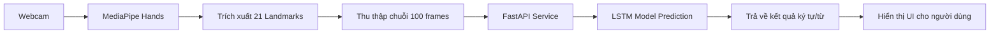

# 🤟 VSL - Nền tảng Học Ngôn ngữ Ký hiệu Việt Nam (Vietnamese Sign Language)


Chào mừng bạn đến với **VSL**, dự án tâm huyết nhằm thu hẹp khoảng cách giao tiếp thông qua công nghệ nhận diện ngôn ngữ ký hiệu dựa trên trí tuệ nhân tạo.

---

## 🌟 Nhóm Phát Triển

Dự án được thực hiện bởi sự nỗ lực và sáng tạo của:
- **Từ Hữu Minh Vũ**: Kiến trúc sư hệ thống, Backend Developer & AI Engineer.
- **Phạm Thị Minh Ngọc**: UI/UX Designer, Frontend Developer & Content Specialist.

---

## 📖 Giới thiệu Dự án

Dự án **Vietnamese Sign Language Learning Platform** là một giải pháp toàn diện bao gồm:
1. **Hệ thống học tập**: Các khóa học từ cơ bản đến nâng cao về từ vựng ký hiệu.
2. **Hệ thống kiểm tra**: Quiz tương tác để đánh giá sự tiến bộ của người học.
3. **Công cụ luyện tập (AI Practice)**: Sử dụng Camera và AI để nhận diện cử chỉ tay người dùng trong thời gian thực.
4. **Trợ lý ảo (Chatbot)**: Hỗ trợ giải đáp các thắc mắc về ngôn ngữ ký hiệu sử dụng Google Gemini AI.

---

## 🚀 Công Nghệ Sử Dụng

Dự án được xây dựng trên một kiến trúc hiện đại, phân tách rõ ràng giữa các lớp:

### 🎨 Frontend (Giao diện người dùng)
- **Framework**: React 19 + Vite (tối ưu hóa tốc độ build và load).
- **Styling**: Tailwind CSS (Thiết kế hiện đại, responsive).
- **Computer Vision**: @mediapipe/hands (Trích xuất đặc trưng bàn tay trực tiếp trên trình duyệt).
- **State Management**: React Context API & Custom Hooks.
- **Navigation**: React Router DOM v7.

### ⚙️ Backend (Xử lý nghiệp vụ)
- **Runtime**: Node.js (v20+).
- **Framework**: Express.js.
- **Database**: MySQL (Quản lý dữ liệu người dùng, khóa học, bài kiểm tra).
- **ORM**: Sequelize (Tương tác database an toàn và hiệu quả).
- **Security**: JWT (JSON Web Token), Bcrypt (mã hóa mật khẩu), Helmet.
- **AI Integration**: Google Generative AI (Gemini Flash 2).

### 🤖 AI Service (Bộ não nhận diện)
- **Framework**: FastAPI (Python 3.10+).
- **Model**: LSTM (Long Short-Term Memory) - phù hợp cho dữ liệu chuỗi thời gian (cử chỉ).
- **Deep Learning**: TensorFlow / Keras.
- **Data Tech**: NumPy, Pandas.

---

## 📐 Kiến Trúc Hệ Thống & Luồng Hoạt Động

### 1. Luồng Nhận Diện Ký Hiệu (Inference Pipeline)


### 2. Luồng Nghiệp Vụ Web
- **Authentication**: Đăng ký/Đăng nhập bảo mật với JWT.
- **Learning**: Người dùng xem video bài giảng và thực hiện bài kiểm tra.
- **Quiz**: Hệ thống tự động chấm điểm và lưu tiến trình học tập.
- **Chatbot**: Sử dụng API Gemini để giải thích các khái niệm về ngôn ngữ ký hiệu một cách thông minh.

---

## 📂 Cấu Trúc Thư Mục

```text
/
├── aiservice/           # Dịch vụ AI (Python/FastAPI)
│   ├── model/           # Chứa file model (.keras) và labels.json
│   ├── api.py           # API endpoint cho dự đoán
│   └── inference.py     # Logic xử lý model & chuẩn hóa dữ liệu
├── backend/             # Server chính (Node.js/Express)
│   ├── config/          # Cấu hình Database & Auth
│   ├── controllers/     # Xử lý logic nghiệp vụ
│   ├── routes/          # Định nghĩa các API routes
│   └── scripts/         # Scripts khởi tạo DB & migrations
├── frontend/            # Giao diện người dùng (React)
│   ├── src/
│   │   ├── components/  # Các component dùng chung
│   │   ├── pages/       # Các trang (Home, Course, Practice...)
│   │   ├── hooks/       # Custom hooks (Hand tracking logic)
│   │   └── context/     # Auth Context
├── database/            # Scripts khởi tạo Schema SQL
└── package.json         # Scripts quản lý toàn bộ dự án
```

---

## 🛠 Hướng Dẫn Cài Đặt và Chạy Dự Án

### 1. Yêu cầu hệ thống
- **Node.js**: v18.0.0 hoặc mới hơn.
- **Python**: 3.9 - 3.11.
- **MySQL**: 8.0+.

### 2. Cài đặt các thành phần
Mở terminal tại thư mục gốc và chạy lệnh:
```bash
npm run install:all
```
Lệnh này sẽ tự động cài đặt `node_modules` cho cả root, backend và frontend.

Tiếp theo, cài đặt thư viện cho AI Service:
```bash
cd aiservice
pip install -r requirements.txt
```

### 3. Cấu hình Biến môi trường (.env)
Tạo file `.env` trong các thư mục tương ứng:
- **backend/.env**: `PORT`, `DB_HOST`, `DB_USER`, `DB_PASS`, `DB_NAME`, `JWT_SECRET`, `GEMINI_API_KEY`.
- **frontend/.env**: `VITE_API_URL`, `VITE_AI_SERVICE_URL`.

### 4. Khởi chạy
Tại thư mục gốc, chỉ cần một lệnh duy nhất để chạy toàn bộ hệ thống:
```bash
npm run dev
```
Hệ thống sẽ chạy đồng thời:
- **Frontend**: http://localhost:5173
- **Backend**: http://localhost:5000
- **AI Service**: http://localhost:8000

---

## 🔍 Chi Tiết Kỹ Thuật về Model AI

Model nhận diện được xây dựng dựa trên mạng **LSTM** với các đặc điểm:
- **Đầu vào (Input)**: Chuỗi 100 frames liên tiếp.
- **Đặc trưng (Features)**: 42 tọa độ (x, y của 21 landmark) trên bàn tay chính.
- **Chuẩn hóa**: Tọa độ được dịch chuyển và scale dựa trên trung tâm bàn tay để đảm bảo tính bất biến với vị trí và khoảng cách đến camera.
- **Độ chính xác**: Được huấn luyện trên hàng ngàn mẫu ký hiệu chuẩn tiếng Việt.

---

## 🤝 Đóng Góp

Nếu bạn có bất kỳ thắc mắc hoặc muốn đóng góp cho dự án, vui lòng liên hệ:
- **Từ Hữu Minh Vũ** (Lead Developer)
- **Phạm Thị Minh Ngọc** (Frontend & Content)

© 2026 Vietnamese Sign Language Learning Platform. All Rights Reserved.
